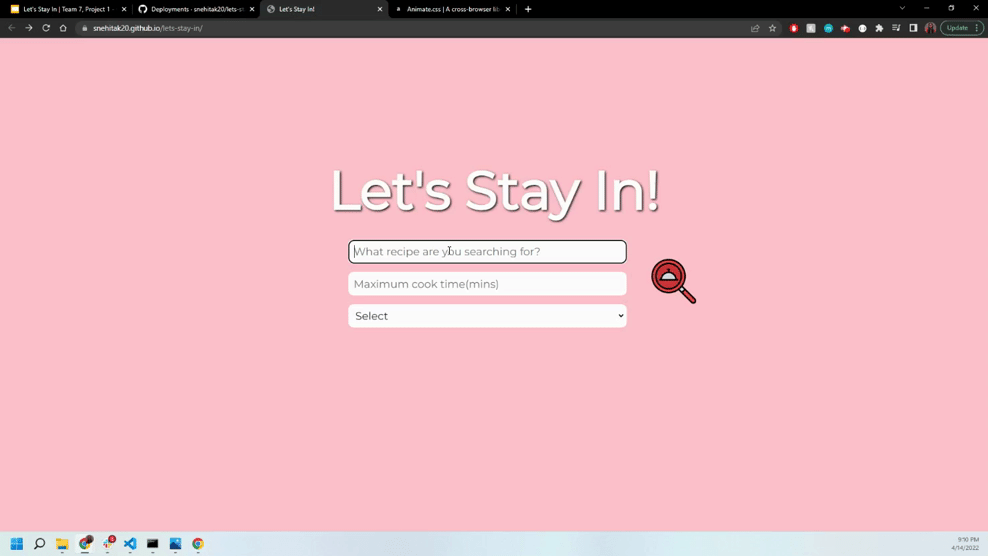

# lets-stay-in

## Description 

Have the ultimate date night in with Let's Stay In. A collaborative effort to cirrate the perfect night in. Let's Stay In will help you pick a recipe based on the main ingredient, cook time, and dietary needs. Entertainment is randomly generated, along with an Techy phrase to impress your date.
JavaScript is our main technology used, along with HTML and CSS. Libraries that were introduced in this project were Foundation and Animate.CSS. Foundation and Animate.CSS were used for adding styles and movement to the page. Foundation modals are generated within JavaScript adding styling with Foundation's CSS class attributes. Modals in Foundation was the biggest challenge at we faced and overcame by adding a call to Foundation within out JavaScript.
Future features we hope to implement would enhance the layout to include a more unique and branded look. Add the ability to take in more recipe and movie search parameters, to create a more tailored user experience.

## Table of Contents

* [Installation](#installation)
* [Usage](#usage)
* [Credits](#credits)
* [License](#license)

## Installation

[Link to deployed application](https://snehitak20.github.io/lets-stay-in/)

## Usage 

Enter in main ingredient to cook with, maximum cook time, and dietary preference.

Pick recipe to cook

Recipe cards are generated on the next page 

Buttons located in a column on the left will generate Techy phrase and Random movie

## Credits

Creators:
* Kristy Guo [LinkedIn](www.linkedin.com/in/kristixxg) || [Github](https://github.com/Kristixxg)
* Snehita Kolli [LinkedIn](https://www.linkedin.com/in/snehita-kolli-0abb23b1/) || [GitHub](https://github.com/snehitak20)
* Sophia Custodia [LinkedIn](https://www.linkedin.com/in/sophia-custodia/) || [GitHub](https://github.com/sophtron5000)

Third Party Libraries:
* [Foundation CSS Framework](https://get.foundation)
* [Animate CSS Library](https://animate.style)

APIs:
* [Spoonacular](https://spoonacular.com/food-api)
* [The Movie Data Base](https://developers.themoviedb.org/)
* [Techy Phrase](https://techy-api.vercel.app/)

## Features

* Search input will wobble if the input is empty or not valid

* Supports multiple media queries written within the CSS documentation. 

## License
Copyright (c) [2022] [SophiaCustodia, SnehitaKolli, KristyGao]
Permission is hereby granted, free of charge, to any person obtaining a copy
of this software and associated documentation files (the "Software"), to deal
in the Software without restriction, including without limitation the rights
to use, copy, modify, merge, publish, distribute, sublicense, and/or sell
copies of the Software, and to permit persons to whom the Software is
furnished to do so, subject to the following conditions:
The above copyright notice and this permission notice shall be included in all
copies or substantial portions of the Software.
THE SOFTWARE IS PROVIDED "AS IS", WITHOUT WARRANTY OF ANY KIND, EXPRESS OR
IMPLIED, INCLUDING BUT NOT LIMITED TO THE WARRANTIES OF MERCHANTABILITY,
FITNESS FOR A PARTICULAR PURPOSE AND NONINFRINGEMENT. IN NO EVENT SHALL THE
AUTHORS OR COPYRIGHT HOLDERS BE LIABLE FOR ANY CLAIM, DAMAGES OR OTHER
LIABILITY, WHETHER IN AN ACTION OF CONTRACT, TORT OR OTHERWISE, ARISING FROM,
OUT OF OR IN CONNECTION WITH THE SOFTWARE OR THE USE OR OTHER DEALINGS IN THE
SOFTWARE.

